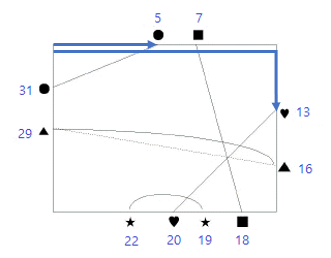

## 문제

직사각형의 변 위에 여러 모양의 점들이 있고, 같은 모양의 점들은 정확히 두 개씩 있다. 단 직사각형의 꼭짓점에 놓인 점은 없다. 이제 같은 모양의 두 점들을 직선이나 곡선으로 연결하려고 한다. 연결된 선들은 반드시 직사각형의 내부만을 지나야 하며, 세 개 이상의 연결선들이 한 점에서 만나서는 안 된다. 연결선과 연결선이 만나는 교차점의 개수를 가장 작게 하려고 할 때 최소 교차점의 개수를 구하는 프로그램을 작성하시오.

예를 들어, 점들이 아래 그림과 같이 주어졌다고 하자. 각 점의 위치는 두 개의 양의 정수로 표시된다. 첫째 숫자는 점이 위치한 변을 나타내는데, 1은 윗변, 2는 밑변, 3은 왼쪽 변, 4는 오른쪽 변을 의미한다. 둘째 숫자는 변 위에서의 위치를 나타낸다. 점이 윗변이나 밑변에 있는 경우는 왼쪽 꼭짓점부터의 거리를 나타내고, 점이 왼쪽 변이나 오른쪽 변에 있는 경우는 위쪽 꼭짓점부터의 거리를 나타낸다. 즉, 점 (4, 7)은 오른쪽 변에 있는 점으로 변의 위쪽 꼭짓점으로부터 거리 7만큼 떨어져 있다. 이 그림에서, 두 점(3, 5)와 (4, 7)을 점선과 같이 연결하여, 세 개의 연결선들이 한 점에서 만나게 하면 안 된다. 이 그림에서 최소 교차점의 개수는 4이다.


---

## 입력

입력의 첫째 줄에는 주어진 점들의 개수가 있다. 단, 점들의 개수는 50을 넘지 않는다. 둘째 줄 이후부터는 각 줄에 모양이 같은 두 점의 위치가 네 개의 숫자로 주어지는데, 첫 번째와 두 번째 숫자가 한 점을 나타내고 세 번째와 네 번째 숫자가 다른 한 점을 나타낸다. 주어진 점들의 위치는 모두 다르다. 각 숫자는 양의 정수이며, 숫자 사이에는 빈칸이 하나 있다.

---

## 출력

출력의 첫째 줄에는 최소 교차점의 개수를 출력하고, 둘째 줄에 가장 많은 교차점을 갖는 연결선의 교차점 개수를 출력한다.

---

## 풀이

```python
n = int(input())
pos_list = [list(map(int, input().split())) for _ in range(n // 2)]
max_x = 0
max_y = 0
for pos in pos_list:
    for i in range(0, 3, 2):
        if pos[i] == 1 or pos[i] == 2:
            if pos[i + 1] > max_x:
                max_x = pos[i + 1] + 1
        if pos[i] == 3 or pos[i] == 4:
            if pos[i + 1] > max_y:
                max_y = pos[i + 1] + 1


def pos_tranpose(pos_list, max_x, max_y):
    new_pos_list = []
    for pos in pos_list:
        new_pos = []
        for i in range(0, 3, 2):
            if pos[i] == 1:
                new_pos.append(pos[i + 1])
            if pos[i] == 2:
                new_pos.append(2 * max_x + max_y - pos[i + 1])
            if pos[i] == 3:
                new_pos.append(2 * max_x + 2 * max_y - pos[i + 1])
            if pos[i] == 4:
                new_pos.append(max_x + pos[i + 1])
        new_pos_list.append(new_pos)
    return new_pos_list


def check(a1_pos, a2_pos, b1_pos, b2_pos):
    start_pos = min(a1_pos, a2_pos)
    end_pos = max(a1_pos, a2_pos)
    if b1_pos in range(start_pos, end_pos) and b2_pos not in range(start_pos, end_pos):
        return True
    if b1_pos not in range(start_pos, end_pos) and b2_pos in range(start_pos, end_pos):
        return True
    return False


pos_list = pos_tranpose(pos_list, max_x, max_y)
count_1 = 0
count_2 = 0
for src_pos in pos_list:
    cur_count = 0
    for tgt_pos in pos_list:
        if src_pos != tgt_pos:
            if check(src_pos[0], src_pos[1], tgt_pos[0], tgt_pos[1]):
                count_1 += 1
                cur_count += 1
    if cur_count > count_2:
        count_2 = cur_count

print(count_1 // 2)
print(count_2)

```

직사각형의 변 위에 존재하는 두 점이 주어졌을 때 그 점을 잇는 선들의 교차점의 최소 개수와 가장 많은 교차점을 갖는 선분의 교차점 개수를 구하는 문제입니다. 3쌍의 좌표를 각각 잇는 직선이 한 점에서 만나면 안되기 때문에 직선이 아닌 연결선으로 제한하고, 곡선이 가능하기 때문에 최소라는 제한을 둔 문제입니다. 문제를 보고나서 바로 떠오르는 가장 심플하게(?) 구현하는 방법은 두 점을 잇는 직선을 만들고 각 직선의 모든 교차점을 더하는 방법이었는데, 이는 각 교차점이 정수가 아닌 실수형으로 구해지면서 오차가 발생할 수 있기 때문에 다른 방법을 선택하였습니다.


위 그림에서 (1, 7), (2, 8)을 잇는 연결선을 기준으로 (1, 7)에서 출발해서 오른쪽 방향으로 직사각형의 변을 따라 가면서 아래 그림처럼 파란 영역에 다른 연결선들의 한 좌표는 존재하고 나머지 좌표는 존재하지 않는다면 해당 연결선과 교차점을 갖게 됩니다. 


위 과정을 주어진 좌표를 가지고 구현하기에는 처리해야하는 경우의 수가 너무 많아 주어진 좌표를 다른 좌표 형태로 변환하는 과정을 거쳤는데, 직사각형의 왼쪽 위 꼭짓점부터 시작하여 오른쪽 방향으로 직사각형의 변을 따라 얼마만큼 이동했는지에 대한 거리로 좌표계를 변환하였습니다. 예를 들어 주어진 좌표들에서 최대 가로 길이를 max_x, 최대 세로 길이를 max_y라 하면 위의 예에서는 max_x=9, max_y=8로 설정할 수 있습니다.(각 점들은 꼭짓점에 위치할 수 없으므로 +1 해줍니다) 이를 통해 (2, 8)은 18로 변환되게 됩니다. 이 과정을 위 코드에서 pos_transpose로 구현되어 있습니다.



이렇게 변환된 좌표를 가지고 연결선 중 작은 좌표를 가진 점에서 큰 좌표를 가진 점까지의 영역에 다른 연결선이 하나의 점만 포함되는지 체크하고 이러한 과정을 모든 연결선에 대해서 수행합니다. 이렇게 진행하여 구한 교차점의 개수는 하나씩 중복되어 구해졌으므로 2를 나눠서 최종적으로 최소 교차점의 개수를 구할 수 있게됩니다.