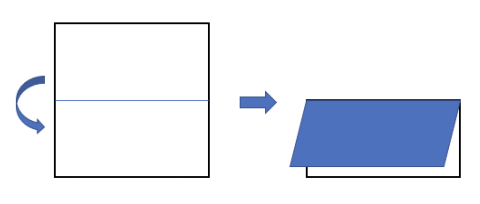
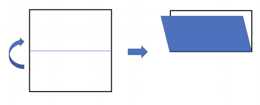
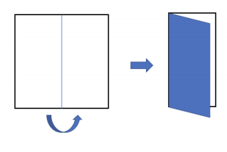
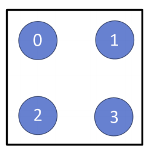

## 문제

정사각형의 종이를 중앙선을 중심으로 접는 방법은 아래 그림에서 보인 것처럼 4가지가 있다.

- `D`: 가로 중심선을 중심으로 반으로 접되 윗 면이 아랫 면을 덮도록 접음



- `U`: 가로 중심선을 중심으로 반으로 접되 아랫 면이 윗 면을 덮도록 접음



- `R`: 세로 중심선을 중심으로 반으로 접되 왼쪽 면이 오른쪽 면을 덮도록 접음



- `L`: 세로 중심선을 중심으로 반으로 접되 오른쪽 면이 왼쪽 면을 덮도록 접음


한 변의 길이가 2k인 정사각형 종이가 있을 때, 이를 세로로 k번, 가로로 k번 접으면 (접는 순서는 상관 없음) 각 변의 길이가 1인 정사각형이 된다. 아래 그림에서 보인 것처럼 각 변의 길이가 1인 정사각형의 네 귀퉁이 중 한 군데에 구멍을 낸다. 구멍의 위치는 그림에서 보인 것처럼 숫자로 표시한다.



구멍을 낸 후 접은 순서의 역순으로 종이를 펼치면, 종이에 22k개의 구멍이 있게 된다. 예를 들어, 한 변의 길이가 4(= 22)인 정사각형을 <`R`, `D`, `D`, `R`>순서대로 접은 후, 3번 위치에 구멍을 낸 다음 종이를 펼치면 아래 그림처럼 구멍이 나게 된다.


종이의 크기를 나타내는 정수 k, 종이를 접는 순서를 나타내는 정보, 구멍 뚫는 위치를 나타내는 정수가 주어질 때, 2k × 2k 격자에 뚫린 구멍의 위치를 출력하는 프로그램을 작성하시오.

---

## 입력

첫 번째 줄에 k가 주어진다.

다음 줄에는 종이 접는 방법을 나타내는 문자가 2k개 주어지는데, 각 문자는 공백으로 구분된다. 종이를 접는 방법 `D`, `U`, `R`, `L`은 각각 해당하는 대문자 알파벳으로 주어진다.

다음 줄에는 구멍 뚫는 위치를 나타내는 정수 h(0 ≤ h ≤ 3) 가 주어진다.

---

## 출력

접힌 종이를 접은 순서의 역순으로 펼친 후 정사각형에 뚫린 구멍의 위치를 번호로 출력한다. 출력은 총 2k줄로 이루어지며 i (1 ≤ i ≤ 2k)번째 줄에는 격자의 i번 행에 뚫린 구멍의 번호를 왼쪽에서 오른쪽 순서로, 공백을 사이에 두고 출력한다.

---

## 풀이

```python
k = int(input())
cmds = input()
hole_i = int(input())
hole_kinds = [[0, 0], [0, 1], [1, 0], [1, 1]]

row_i = [[i, False] for i in range(2 ** k)]
col_i = [[i, False] for i in range(2 ** k)]

row_cmd = []
col_cmd = []
for cmd in cmds:
    if cmd == "R":
        col_cmd.append(False)
    elif cmd == "L":
        col_cmd.append(True)
    elif cmd == "U":
        row_cmd.append(True)
    elif cmd == "D":
        row_cmd.append(False)


def fold(list_i, cmds):
    if len(list_i) > 1:
        ret = []
        cmd = cmds.pop(0)
        if cmd == False:
            list_i[: len(list_i) // 2] = list(map(lambda x: [x[0], not x[1]], list_i[: len(list_i) // 2]))
            ret.extend(fold(list_i[: len(list_i) // 2], list(map(lambda x: not x, cmds))))
            ret.extend(fold(list_i[len(list_i) // 2 :], cmds.copy()))
        elif cmd == True:
            list_i[len(list_i) // 2 :] = list(map(lambda x: [x[0], not x[1]], list_i[len(list_i) // 2 :]))
            ret.extend(fold(list_i[: len(list_i) // 2], cmds.copy()))
            ret.extend(fold(list_i[len(list_i) // 2 :], list(map(lambda x: not x, cmds))))
        return ret
    else:
        return list_i


row_ret = fold(row_i, row_cmd)
col_ret = fold(col_i, col_cmd)

for row_idx in row_ret:
    for col_idx in col_ret:
        hole_ret = hole_kinds[hole_i].copy()
        if row_idx[1]:
            hole_ret[0] = not hole_ret[0]
        if col_idx[1]:
            hole_ret[1] = not hole_ret[1]
        print(hole_kinds.index(hole_ret), end=" ")
    print()
```

각 변의 길이가  2^k인 정사각형 종이가 주어졌을 때 가로로 k번 세로로 k번 접고나서 네 모퉁이 중 한 곳에 구멍을 뚫었을 때 피고나서 각 종이의 격자 모양에 생긴 구멍의 위치를 출력하는 문제입니다.

먼저 종이에 생길 구멍 위치를 각 격자 마다 저장하는 2차원 행렬로 표현을 하기엔 각 정사각형의 길이가 2^k이므로 2^(2k)의 크기를 가진 배열이 필요하게 됩니다. 이 방식은 메모리 초과 오류를 내기 때문에 다른 방법을 사용해서 구멍의 위치를 나타내야 합니다.

구멍의 위치가 뒤집히는 것은 가로 방향으로 뒤집히는 것과 세로 방향으로 뒤집히는 것은 독립적입니다. 따라서 저는 가로 방향이 뒤집힌 것을 나타내는 col_i와 세로 방향이 뒤집힌 것을 나타내는 row_i를 사용하여 해당 인덱스에 위치한 격자가 가로로 뒤집혔는지 세로로 뒤집혔는지를 나타냈습니다.

격자가 뒤집히는지 여부는 만약 R 방법을 사용하여 종이를 접는다고 하면 주어진 col_i에서 왼쪽의 절반 인덱스 부분은 가로로 뒤집히게 됩니다. 또한 왼쪽 부분의 순서 또한 뒤집히게 됩니다. 그리고 절반으로 나뉘었기 때문에 각각 절반에 대해서 같은 방법으로 절반을 나누면서 접는 방향의 부분을 뒤집히는 상태를 반영하고 결국 이 문제는 전체 문제를 절반으로 나누면서 상태를 변경하는 분할 정복 문제로 접근할 수 있습니다.

이렇게 재귀를 사용하여 접히는 방향에 따라 해당 위치가 뒤집히는지 여부를 반영하는 함수를 fold로 구현하였고 각 가로 방향과 세로 방향에 대해 구하면서 최종적으로 해당 인덱스에서 가로로 뒤집히는지 세로로 뒤집히는지 여부를 구할 수 있습니다.

이 때 출력은 왼쪽 상단에서 차례로 출력해야 하기 때문에 인덱스 기준으로 다시 정렬해주고 순회하면서 가로 세로가 뒤집혔는지 여부에 따라 기존에 구멍이 뚫린 위치에서 뒤집힌 구멍의 위치를 출력하면 문제 풀이에 성공할 수 있습니다.