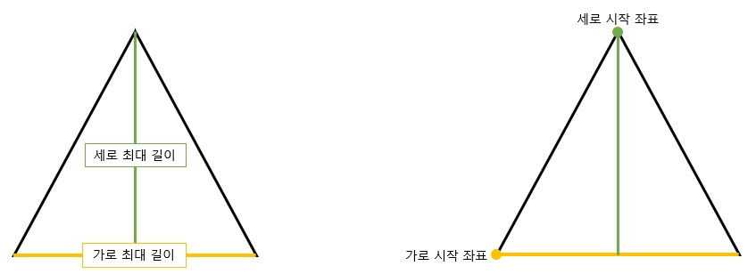
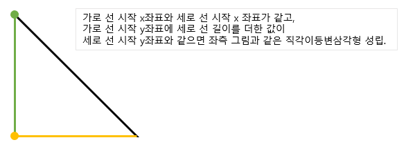

## 문제

가로 10줄, 세로 10줄에 1 또는 0이 적혀진 배열이 있다. 이러한 배열 안에 있는 숫자 1들이 만드는 모양이 한 개의 직각이등변삼각형인지 아닌지 알아내는 프로그램을 작성하시오.

직각이등변삼각형의 적어도 한 변은 수평선 또는 수직선이다. 단, 직각이등변삼각형의 내부도 1로 채워져 있어야 한다. 입력된 모양은 삼각형이 아닐 수 있다.

---

## 입력

입력은 10줄로 이루어지며 각 줄은 첫 칸부터 공백없이 10개의 0또는 1로 이루어진다.

---

## 출력

입력된 모양이 직각이등변 삼각형을 이루는 경우에는 세 꼭짓점의 위치를 출력하고, 그렇지 않은 경우에는 0을 출력한다. 각 꼭짓점의 위치를 한 줄에 두 개의 수로 출력한다. 두 수는 하나의 빈 공백을 두고 출력한다. 첫째 수는 그 꼭짓점이 위에서부터 몇 번째 줄에 있는가 나타내며, 두 번째 수는 왼쪽부터 몇 번째 칸에 있는가를 나타내야 한다. 꼭짓점을 출력할때는 첫째 수가 작은 것부터, 첫째 수가 같을 경우 두 번째 수가 작은 것부터 출력한다.

---

## 풀이

```python
array = [[int(i) for i in input()] for _ in range(10)]

row_pos = []
row_max = 0
col_pos = []
col_max = 0
for i in range(10):
    for j in range(10):
        if array[i][j] == 1:
            pos = [i, j]
            row_len = 1
            col_len = 1
            for j2 in range(j + 1, 10):
                if array[i][j2] == 1:
                    row_len += 1
                if row_len > row_max:
                    row_max = row_len
                    row_pos = pos
            for i2 in range(i + 1, 10):
                if array[i2][j] == 1:
                    col_len += 1
                if col_len > col_max:
                    col_max = col_len
                    col_pos = pos


def check(array, row_pos, col_pos, row_max, col_max):
    if row_max == col_max:
        if row_pos[0] == col_pos[0] and row_pos[1] == col_pos[1]:
            for i in range(col_max):
                for j in range(row_max - i):
                    if array[row_pos[0] + i][row_pos[1] + j] != 1:
                        return -1
            return [[row_pos[0], row_pos[1]], [row_pos[0], row_pos[1] + row_max - 1], [row_pos[0] + col_max - 1, row_pos[1]]]
        if (row_pos[1] + row_max - 1) == col_pos[1] and row_pos[0] == col_pos[0]:
            for i in range(col_max):
                for j in range(i, row_max):
                    if array[row_pos[0] + i][row_pos[1] + j] != 1:
                        return -1
            return [[row_pos[0], row_pos[1]], [row_pos[0], row_pos[1] + row_max - 1], [row_pos[0] + col_max - 1, row_pos[1] + row_max - 1]]
        if row_pos[1] == col_pos[1] and row_pos[0] == (col_pos[0] + col_max - 1):
            for i in range(col_max):
                for j in range(i + 1):
                    if array[col_pos[0] + i][col_pos[1] + j] != 1:
                        return -1
            return [[col_pos[0], col_pos[1]], [col_pos[0] + col_max - 1, col_pos[1]], [col_pos[0] + col_max - 1, col_pos[1] + row_max - 1]]
        if (row_pos[1] + row_max - 1) == col_pos[1] and row_pos[0] == (col_pos[0] + col_max - 1):
            for i in range(col_max):
                for j in range(row_max - i - 1, row_max):
                    if array[col_pos[0] + i][row_pos[1] + j] != 1:
                        return -1
            return [[col_pos[0], col_pos[1]], [row_pos[0], row_pos[1]], [col_pos[0] + col_max - 1, col_pos[1]]]
    else:
        if row_max % 2 == 1 and row_max // 2 + 1 == col_max:
            if (row_pos[1] + row_max // 2) == col_pos[1] and row_pos[0] == col_pos[0]:
                for i in range(col_max):
                    for j in range(-col_max + i + 1, col_max - i):
                        if array[col_pos[0] + i][col_pos[1] + j] != 1:
                            return -1
                return [[row_pos[0], row_pos[1]], [row_pos[0], row_pos[1] + row_max - 1], [col_pos[0] + col_max - 1, col_pos[1]]]
            if (row_pos[1] + row_max // 2) == col_pos[1] and row_pos[0] == (col_pos[0] + col_max - 1):
                for i in range(col_max):
                    for j in range(-i, i + 1):
                        if array[col_pos[0] + i][col_pos[1] + j] != 1:
                            return -1
                return [[col_pos[0], col_pos[1]], [row_pos[0], row_pos[1]], [row_pos[0], row_pos[1] + row_max - 1]]
        if col_max % 2 == 1 and row_max == col_max // 2 + 1:
            if (col_pos[0] + col_max // 2) == row_pos[0] and col_pos[1] == row_pos[1]:
                for j in range(row_max):
                    for i in range(-row_max + j + 1, row_max - j):
                        if array[row_pos[0] + i][row_pos[1] + j] != 1:
                            return -1
                return [[col_pos[0], col_pos[1]], [row_pos[0], row_pos[1] + row_max - 1], [col_pos[0] + col_max - 1, col_pos[1]]]
            if (col_pos[0] + col_max // 2) == row_pos[0] and col_pos[1] == (row_pos[1] + row_max - 1):
                for j in range(row_max):
                    for i in range(-j, j + 1):
                        if array[row_pos[0] + i][row_pos[1] + j] != 1:
                            return -1
                return [[col_pos[0], col_pos[1]], [row_pos[0], row_pos[1]], [col_pos[0] + col_max - 1, col_pos[1]]]
    return -1


if row_max == 0 or col_max == 0:
    print(0)
else:
    ret = check(array, row_pos, col_pos, row_max, col_max)
    if ret == -1:
        print(0)
    else:
        for pos in ret:
            print(pos[0] + 1, pos[1] + 1)

```

배열에 존재하는 숫자 1들이 직각이등변삼각형인지 아닌지 여부를 판단하고 직각이등변삼각형이면 꼭지점의 좌표를 출력하는 문제입니다. 문제 자체는 그렇게 난이도 있는 것 같진 않는데 구현하는데 많은 시간이 걸린 문제입니다...



먼저 적어도 한 변은 수평선 또는 수직선이라는 조건이 주어졌기 때문에, 가로로 쭉 한번 훑고 세로로 쭉 한번 훑어서 1로 구성된 가장 긴 가로 길이와 가장 긴 세로 길이와 시작 좌표를 구했습니다. 그리고나서 가로 길이와 세로 길이가 같으면 아래와 같이 4종류의 직각이등변삼각형이 존재할 수 있습니다.


가로 길이와 세로 길이가 다를 때에는 가로 길이가 세로 길이의 절반 또는 세로 길이가 가로 길이의 절반 일 때 아래와 같이 4종류의 직각이등변삼각형이 존재할 수 있습니다.


주어진 도형이 위의 총 8종류의 직각이등변삼각형을 만족하는지 판단은 최대 가로 길이와 시작 좌표, 최대 세로 길이와 시작 좌표를 사용해서 해당 직각이등변삼각형에 속하는지 판단했습니다. 그리고 나서 도형 내부가 1로 가득차 있으면 해당 직각이등변삼각형의 꼭지점을 반환하고 아닐시에 -1을 반환하도록 함수를 구현했습니다.



마지막으로 빈 배열이나 혹은 가로줄 또는 세로줄만 존재할 수 있기 때문에 예외처리를 83번 라인에서 해주고 나서 check 함수를 통해 직각이등변삼각형 여부를 판단하고 각 꼭지점을 출력하여 문제 풀이에 성공했습니다.

개인적으로는 알고리즘이 어렵진 않고 어떻게 빠르게 쉬운 방법으로 구현하냐가 중요했던 문제 같습니다. 뭔가 하나하나 모든 경우의 수를 따지지 않고 직각이등변삼각형을 판단할 수 있는 방법이 존재할 것 같은데 제 머리는 이게 한계인가 봅니다..